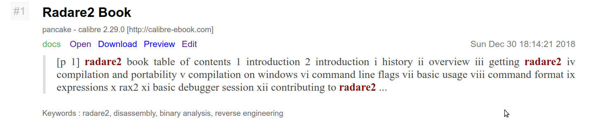

# recoll-web-ui-template

This is a customized result.tpl template for recoll's web interface.  I've added:

1) a link to an edit function for the document's exif data.  I'll eventually get around to posting it on Github.  For now it's a work in progress.  (Note: the "Open / Download / Preview / Edit" line only appears when the mouse hovers above the individual result.)

2) a display of each document's associated keywords, which recoll already indexes.  Eventually, each keyword will link to a separate listing of files associated with that keyword.  For now, it's a static display of keywords that I've embedded in my documents' exif data.  The Python code in this template is somewhat of a dirty kluge in that recoll (by default) likes to display keywords twice.  (Note: this may be a result of my using the incorrect variable.  Investigation is ongoing.)

Example result is below:

---

